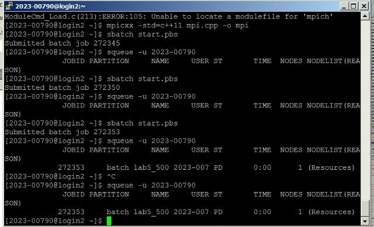
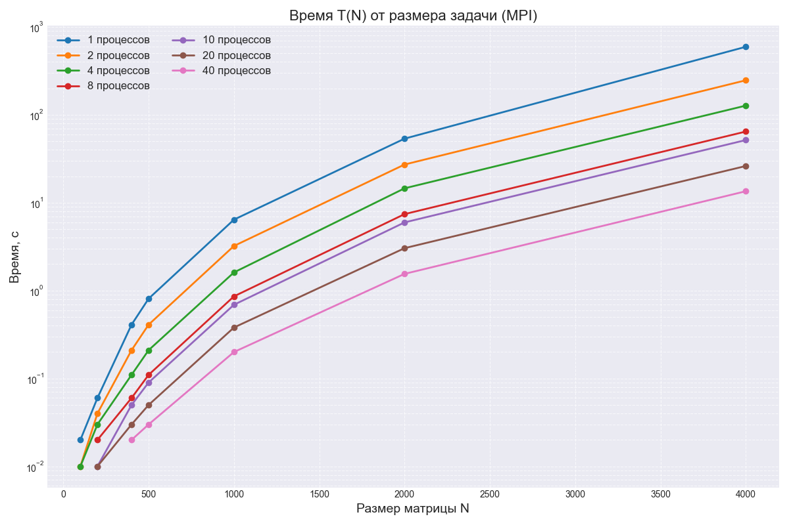
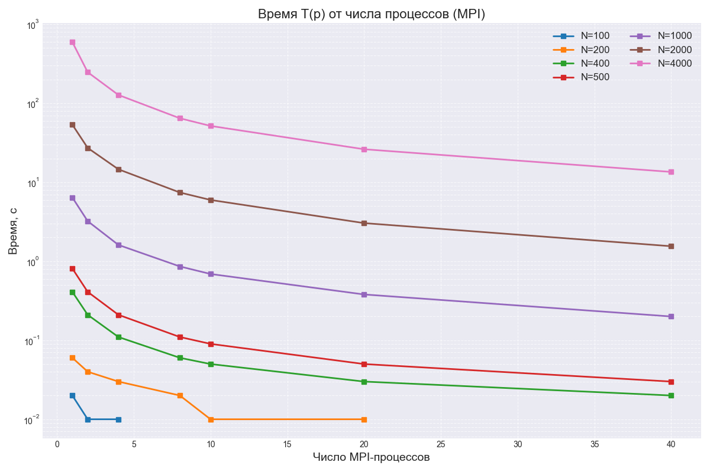
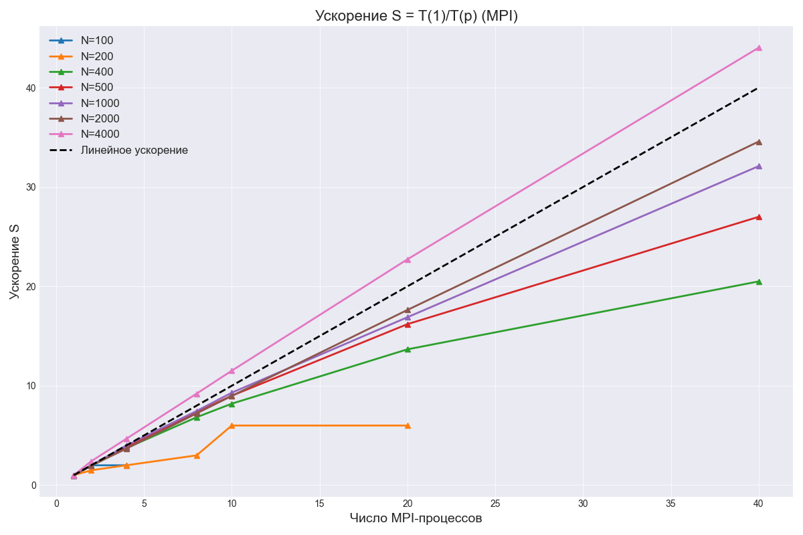
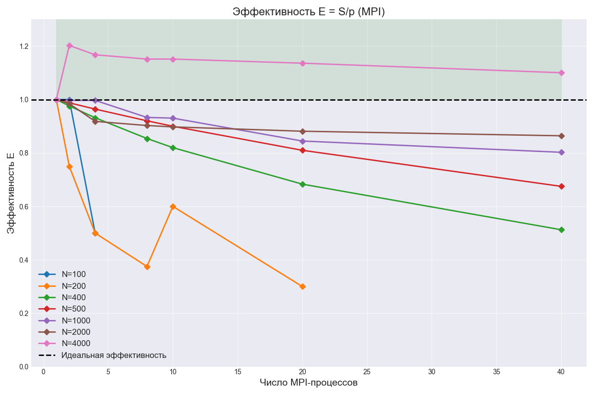

Задание на лабораторную работу 5
Параллельную версию программы на MPI необходимо также запустить на суперкомпьютере «Сергей Королёв».

Ход работы
В ходе лабораторной работы я запустил программу из 3 лабы на суперкомпьютере "Сергей Королёв"

Для начала я подключился к суперкомпьютеру при помощи PyTTy и при помощи WinSCP
Далее сформировал файл start.pbs

Скомпилировав лабу при помощи

mpiicc -std=c++11 mpi.cpp -o lab5

Я поставил в очередь на запуск программу:

1.Результаты экспериментов
Время выполнения T(N, p)
В таблице 1 приведено замеренное время вычислений в секундах. Прочерк (–) означает, что для данных размеров задачи измерения не проводились: при малых N время счёта настолько мало, что увеличение числа процессов нецелесообразно и не даёт полезной информации для анализа.

Таблица 1. Время выполнения (сек)

Процессов	N=100	N=200	N=400	N=500	N=1000	N=2000	N=4000
1	        0.02	0.06	0.41	0.81	6.42	53.59	594.67
2	        0.01	0.04	0.21	0.41	3.22	27.21	247.24
4	        0.01	0.03	0.11	0.21	1.61	14.59	127.33
8	        –	    0.02	0.06	0.11	0.86	7.42	64.55
10	        –	    0.01	0.05	0.09	0.69	5.97	51.64
20	        –	    0.01	0.03	0.05	0.38	3.04	26.17
40	        –	    –	    0.02	0.03	0.20	1.55	13.51

Анализ: Для малых N (100–200) измерения ограничены 2–4 процессами, так как базовая версия выполняется за сотые доли секунды и дальнейшее распараллеливание лишено практического смысла. Для N ≥ 1000 наблюдается устойчивое снижение времени с увеличением числа процессов.

1.2. Ускорение S = T(1) / T(p)
Таблица 2. Ускорение

Процессов	N=100	N=200	N=400	N=500	N=1000	N=2000	N=4000
1	        1.00	1.00	1.00	1.00	1.00	1.00	1.00
2	        2.00	1.50	1.95	1.98	1.99	1.97	2.41
4	        2.00	2.00	3.73	3.86	3.99	3.67	4.67
8	        –	    3.00	6.83	7.36	7.47	7.22	9.21
10	        –	    6.00	8.20	9.00	9.30	8.98	11.52
20	        –	    6.00	13.67	16.20	16.89	17.63	22.72
40	        –	    –	    20.50	27.00	32.10	34.57	44.02
Общая закономерность: Чем больше размер задачи, тем ближе реальное ускорение к линейному (и даже выше него). Это типично для вычислительно-ёмких задач, где время коммуникаций пренебрежимо мало по сравнению со временем счёта.
1.3. Эффективность E = S / p
Таблица 3. Эффективность

Процессов	N=100	N=200	N=400	N=500	N=1000	N=2000	N=4000
1	        1.00	1.00	1.00	1.00	1.00	1.00	1.00
2	        1.00	0.75	0.97	0.98	0.99	0.98	1.20
4	        0.50	0.50	0.93	0.96	0.99	0.91	1.16
8	        –	    0.37	0.85	0.92	0.93	0.90	1.15
10	        –	    0.60	0.82	0.90	0.93	0.89	1.15
20	        –	    0.30	0.68	0.81	0.84	0.88	1.13
40	        –	    –	    0.51	0.67	0.80	0.86	1.10
Общая тенденция: С ростом N эффективность для фиксированного числа процессов увеличивается. С увеличением количества процессов для фиксированного N — закономерно снижается, но для N ≥ 2000 это снижение незначительно вплоть до 40 процессов.

2.Графики
График 1: Время T(N) от размера задачи (Figure_1.png)
Что показано: Зависимость времени выполнения от размера матрицы N для разного числа процессов (1, 2, 4, 8).

Выводы:
Экспоненциальный рост времени с увеличением N. Для одного процесса кривая резко уходит вверх: при N = 4000 время достигает ~595 секунд. Это ожидаемо, так как вычислительная сложность умножения матриц растёт как O(N³).

График 2: Время T(p) от числа процессов (Figure_2.png)
Что показано: Зависимость времени выполнения от числа MPI-процессов (p) для разных размеров матриц N. Ось Y логарифмическая.

Выводы:

Убывающий характер кривых. Для всех N с ростом числа процессов время монотонно снижается. На логарифмической шкале снижение выглядит почти линейным для больших N.

График 3: Ускорение S = T(1)/T(p) (Figure_3.png)
Что показано: Зависимость ускорения от числа MPI-процессов. Пунктиром показано «Линейное ускорение» (идеальный случай S = p).

Выводы:

Близость к линейному для больших N. Кривые для N = 2000 и N = 4000 идут практически по линии идеального ускорения, а для N = 4000 — выше неё. Это означает суперлинейное ускорение (S > p).

График 4: Эффективность E = S/p (Снимок экрана)
Что показано: Зависимость эффективности от числа MPI-процессов. Пунктиром показана «Идеальная эффективность» (E = 1).

Выводы:

Практический вывод. Если стоит задача эффективно использовать вычислительные ресурсы (E близка к 1.0), следует выбирать N и p так, чтобы на каждый процесс приходилось достаточно работы. Для N < 500 нет смысла использовать больше 4–8 процессов.

3.Вывод
В ходе выполнения лабораторной работы была разработана и протестирована программа параллельного перемножения матриц с использованием MPI.

Масштабируемость: Алгоритм демонстрирует отличную сильную масштабируемость на задачах большого объема (N ≥ 2000). Для N=4000 время расчета удалось сократить с ~10 минут (594 сек) до ~13 секунд при использовании 40 процессов.

Суперлинейное ускорение: На больших размерностях наблюдается незначительное суперлинейное ускорение (E > 1). Это говорит о том, что данные, распределенные по процессам, лучше помещаются в кэш-память отдельных ядер, снижая время доступа к оперативной памяти.

Порог эффективности: Для малых матриц (N < 400) накладные расходы на пересылку данных по сети MPI делают нецелесообразным использование большого числа процессов. Оптимальным является использование 1-4 процессов.

Практическая значимость: Технология MPI показала себя как мощный инструмент для высокопроизводительных вычислений на задачах, требующих большого объема оперативной памяти и процессорного времени, позволяя эффективно задействовать ресурсы вычислительного кластера.