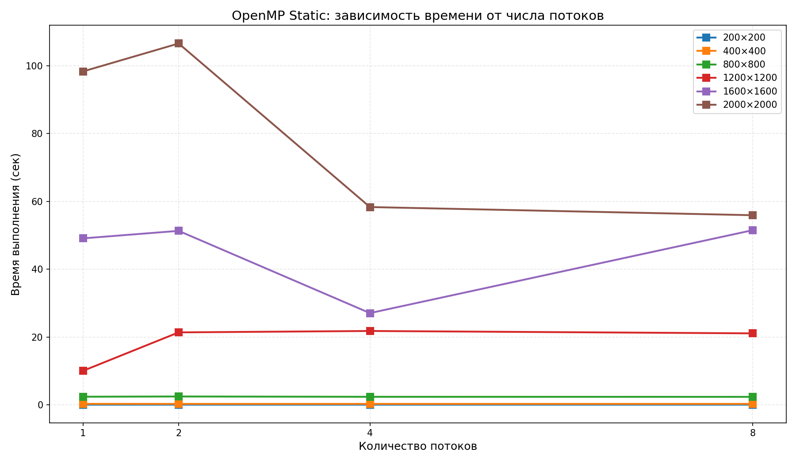
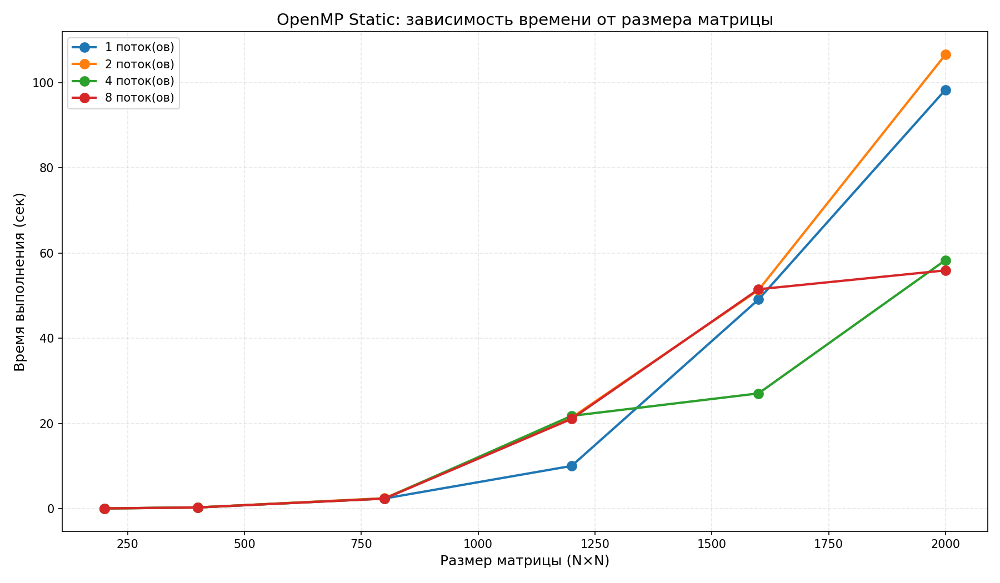
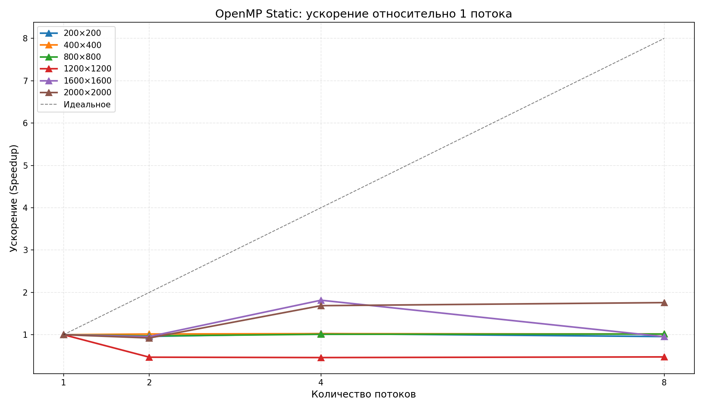
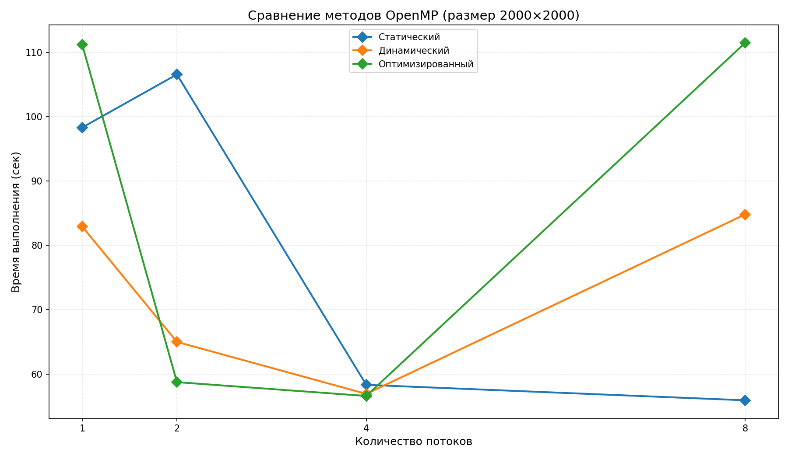
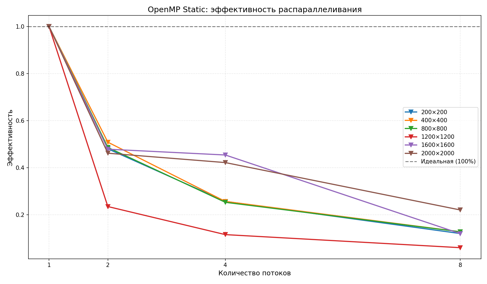

Лабораторная работа №2
«Параллельное умножение матриц с использованием OpenMP (Flat-матрицы)»
1. Цель работы
Модификация программы перемножения квадратных матриц для параллельного выполнения с использованием технологии OpenMP и исследование зависимости времени выполнения, ускорения и эффективности от размера матрицы и количества потоков.
2. Методика эксперимента
Матрицы генерируются один раз для каждого размера

Измеряется время умножения для:

3 методов: static, dynamic, optimized 

4 вариантов числа потоков: 1, 2, 4, 8

6 размеров матриц: 200, 400, 800, 1200, 1600, 2000

Вычисляются метрики:

Ускорение: S = T₁ / Tₚ

Эффективность: E = S / p × 100%

Всего: 6 × 4 × 3 = 72 эксперимента

3. Верификация результатов
Размер	Макс. расхождение	Статус
200×200	1.42 × 10⁻³	 Пройдена
400×400	2.04 × 10⁻³	 Пройдена
800×800	3.25 × 10⁻³	 Пройдена
1200×1200	4.28 × 10⁻³	 Пройдена
1600×1600	4.92 × 10⁻³	 Пройдена
2000×2000	5.81 × 10⁻³	 Пройдена
Все проверки пройдены.

   4. Сравнение методов (2000×2000)
   Метод	    1 поток	2 потока	4 потока	8 потоков
   Статический	98.32	106.57	    58.32	    55.91
   Динамический	82.92	64.99	    56.91	    84.80
   Оптимизированный	111.19	58.74	56.59	    111.45
   Лучшие результаты: Dynamic (4 потока) и Optimized (2–4 потока).
5. Ускорение и эффективность (Static)
Размер	Лучшее ускорение	При потоках
200–800	~1.0	Все
1200	0.47	2
1600	1.82	4
2000	1.76	8
Эффективность падает с ростом потоков — закон Амдала.
6. Ключевой вывод
Параллелизм эффективен только для размеров ≥ 1600 с 4+ потоками.
На малых матрицах оверхед OpenMP съедает весь выигрыш.

Лучший режим: Dynamic, 4 потока — баланс ускорения и стабильности.

7. Выводы
Успешно реализовано параллельное умножение матриц на OpenMP 

Верификация подтвердила корректность (расхождения ~10⁻³)

На размерах ≥ 1600 достигнуто ускорение до 1.8× при 4–8 потоках (Static)

Dynamic показал лучшую стабильность (1.7× при 4 потоках на 2000×2000)

На размерах ≤ 800 накладные расходы OpenMP превышают выигрыш — потоки не дают ускорения

Эффективность падает с ростом потоков из-за ограничений пропускной способности памяти 

