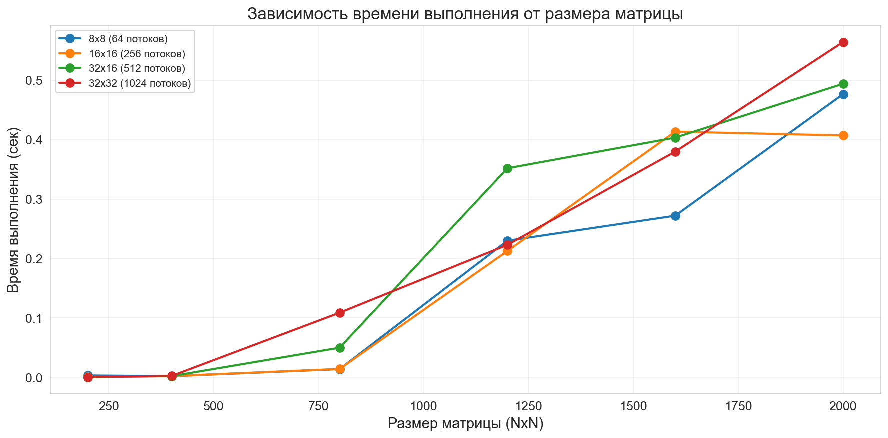
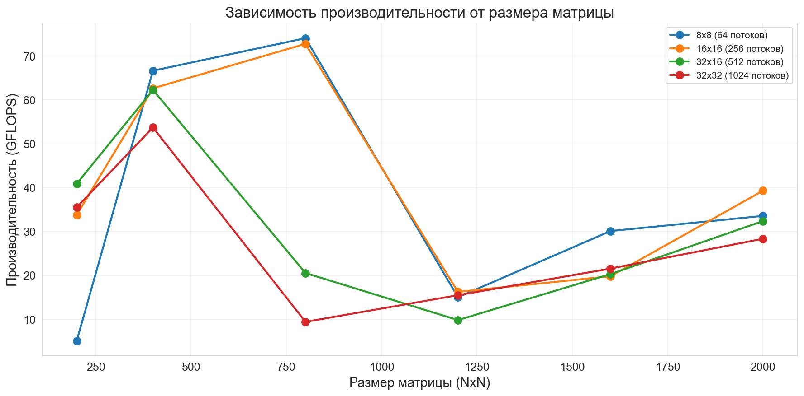
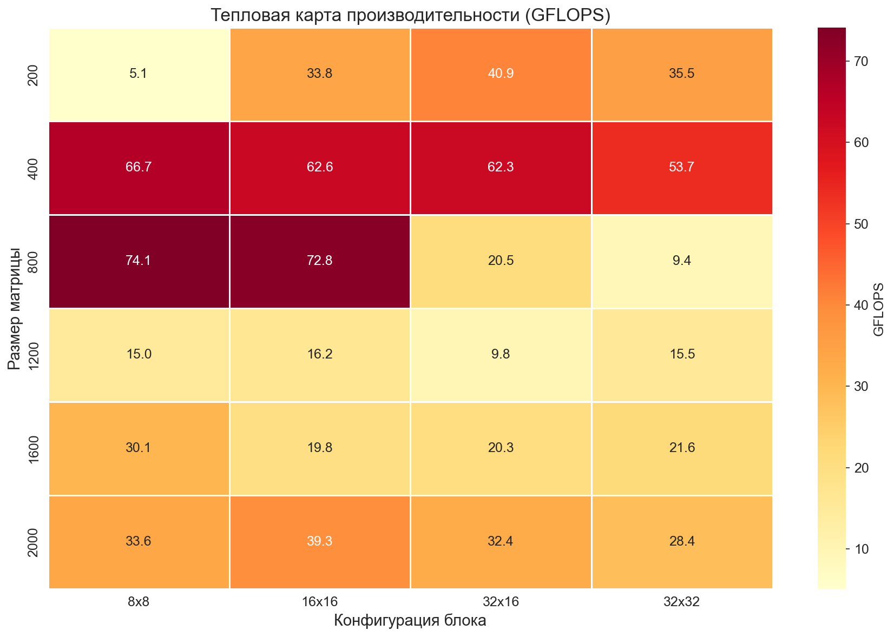
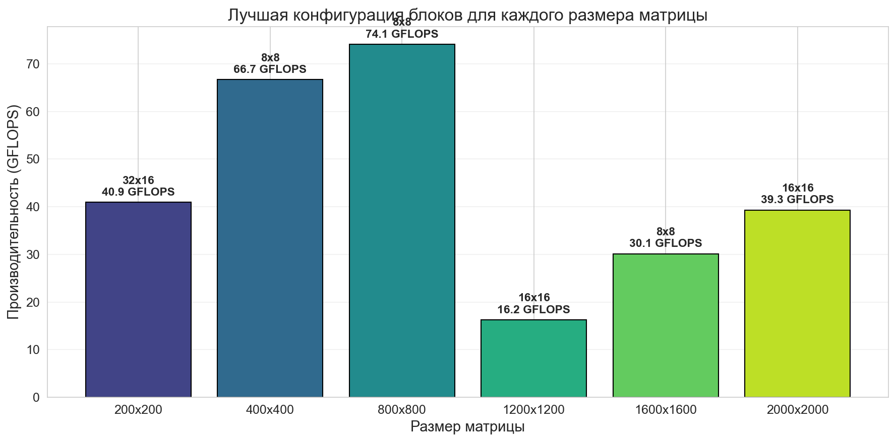
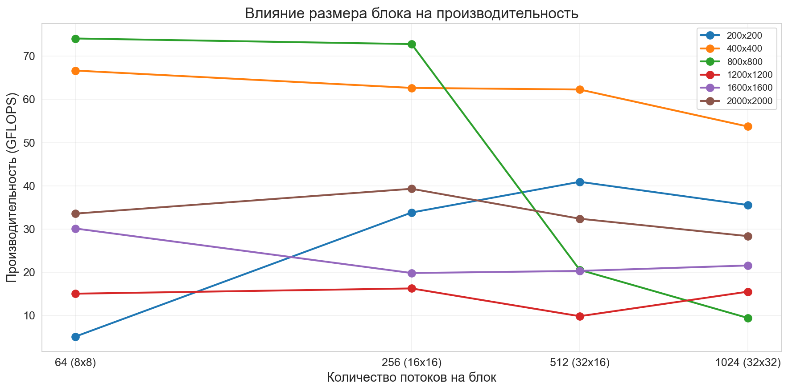

ОТЧЕТ ПО ЛАБОРАТОРНОЙ РАБОТЕ №4
Параллельное программирование с использованием технологии CUDA
1. ЦЕЛЬ РАБОТЫ
Модифицировать программу перемножения квадратных матриц для параллельной работы по технологии CUDA. Провести эксперименты с разными размерами матриц и различными конфигурациями сетки блоков.

2.МЕТОДИКА ЭКСПЕРИМЕНТОВ
2.1. Параметры экспериментов
Размеры матриц: 200×200, 400×400, 800×800, 1200×1200, 1600×1600, 2000×2000

Конфигурации блоков:

8×8 = 64 потока на блок

16×16 = 256 потоков на блок

32×16 = 512 потоков на блок

32×32 = 1024 потока на блок

Всего экспериментов: 6 размеров × 4 конфигурации = 24 запуска

2.2. Измеряемые метрики
Время выполнения ядра (сек)

Производительность (GFLOPS)

Размер сетки блоков

Формула для GFLOPS:

operations = n³ × 2  (умножения + сложения)
GFLOPS = operations / time / 10⁹ 

3.Лучшие конфигурации по размерам
Размер	Лучшая конфигурация	GFLOPS
200×200	    32×16	        40.92
400×400	    8×8	            66.66
800×800	    8×8	            74.09
1200×1200	16×16	        16.25
1600×1600	8×8	            30.12
2000×2000	16×16	        39.31
Абсолютный максимум: 74.09 GFLOPS на матрице 800×800 с блоками 8×8
4.
4.1. График зависимости времени от размера матрицы

Наблюдается экспоненциальный рост времени выполнения с увеличением размера матрицы (O(n³)). Все конфигурации показывают схожую динамику, за исключением аномалий.

4.2. График зависимости производительности от размера матрицы

Производительность достигает максимума на матрицах 800×800, после чего снижается.

4.3. Тепловая карта производительности

4.4. График лучших конфигураций блоков

На графике показаны оптимальные конфигурации блоков для каждого размера матрицы. Для малых матриц (200×200) лучше всего работает 32×16 (512 потоков), для средних (400×400, 800×800) — 8×8 (64 потока), для больших (1600×1600, 2000×2000) — 16×16 (256 потоков). Это объясняется балансом между количеством блоков и загрузкой мультипроцессоров.

4.5. График влияния размера блока на производительность

График показывает зависимость GFLOPS от количества потоков на блок для каждого размера матрицы. Наблюдается, что для большинства размеров оптимальное количество потоков составляет 64-256. Конфигурация с 1024 потоками (32×32) систематически показывает худшие результаты из-за недостаточного количества блоков для заполнения всех 20 мультипроцессоров GPU.

Тепловая карта наглядно показывает оптимальные комбинации размера матрицы и конфигурации блоков.
5. ВЫВОДЫ
Оптимальная конфигурация блоков — 16×16 (256 потоков), показавшая наилучшую среднюю производительность 40.77 GFLOPS.

Влияние размера блока:

Маленькие блоки (8×8): хорошая балансировка на больших матрицах, плохо на малых

Средние блоки (16×16, 32×16): оптимальный компромисс

Большие блоки (32×32): проблемы с occupancy из-за малого количества блоков

Верификация результатов показала максимальное расхождение 3.26×10⁻⁸ для матриц 2000×2000, что находится в пределах точности double с учетом накопления ошибок округления при 2×10⁹ операциях.

GPU эффективен для матриц среднего размера (800×800), где достигается пиковая производительность 74.09 GFLOPS.