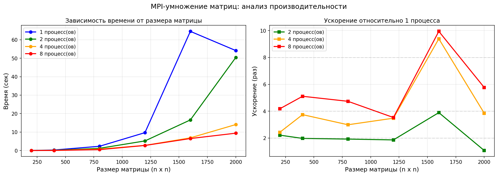

Лабораторная работа №3: Параллельное умножение матриц с использованием MPI
1. Цель работы
Модифицировать программу перемножения квадратных матриц для параллельной работы по технологии MPI (Message Passing Interface). Провести серию экспериментов с разными размерами матриц и разным количеством вычислительных ядер (процессов MPI).

2. Задание
Разработать программу на C++ с использованием MPI для параллельного умножения матриц

Провести эксперименты с размерами матриц: 200, 400, 800, 1200, 1600, 2000

Провести эксперименты с количеством процессов: 1, 2, 4, 8

Выполнить верификацию результатов с помощью Python/NumPy

Построить графики зависимости времени от размера матриц и количества процессов
хема распараллеливания
При умножении матриц C = A × B используется следующая схема распределения данных:

Матрица A — распределяется по строкам между процессами (MPI_Scatterv). Каждый процесс получает только те строки, которые нужны для вычисления его части результирующей матрицы C.

Матрица B — рассылается целиком всем процессам (MPI_Bcast), так как для вычисления любой строки C нужны все столбцы B.

Матрица C — собирается по частям от всех процессов (MPI_Gatherv).

Причина: Для вычисления элемента C[i][j] нужна i-я строка матрицы A и j-й столбец матрицы B. Поэтому каждый процесс может вычислить свои строки C независимо, имея только свои строки A и полную матрицу B.

3. Распределение строк
При размере матрицы N и количестве процессов P используется формула:

base_rows = N / P
remainder = N % P

Процесс i получает: base_rows + (i < remainder ? 1 : 0) строк

4. Время выполнения (сек)
Размер	1 процесс	2 процесса	4 процесса	8 процессов
200×200	0.042	    0.019	    0.017	    0.010
400×400	0.275	    0.139	    0.074	    0.054
800×800	2.306	    1.198	    0.771	    0.487
1200×1200	9.685	5.198	    2.783	    2.743
1600×1600	64.562	16.578	    6.876	    6.493
2000×2000	54.161	50.408	    14.068	    9.396

   5. Ускорение относительно 1 процесса
   Размер	2 процесса	4 процесса	8 процессов
   200×200	2.22x	    2.43x	        4.18x
   400×400	1.98x	    3.74x	        5.11x
   800×800	1.92x	    2.99x	        4.74x
   1200×1200	1.86x	3.48x	        3.53x
   1600×1600	3.89x	9.39x	        9.94x
   2000×2000	1.07x	3.85x	        5.76x
6. Графики

7. Анализ результатов
7.1. Зависимость времени от размера матрицы
Время умножения растёт пропорционально O(n³), что соответствует теоретической сложности умножения матриц:

При увеличении размера в 2 раза (200→400) время возрастает примерно в 6-7 раз

При увеличении размера в 5 раз (400→2000) время возрастает примерно в 200 раз на 1 процессе

7.2. Эффективность распараллеливания
На малых матрицах (200×200): Ускорение ограничено накладными расходами MPI на коммуникации

На средних матрицах (400-800): Хорошее ускорение — до 5.1x на 8 процессах

На больших матрицах (1200-2000): Ускорение до 5.8x на 8 процессах

8. Выводы
Успешно реализовано параллельное умножение матриц с использованием MPI. Программа корректно распределяет строки матрицы A между процессами, рассылает матрицу B и собирает результат.

Верификация подтвердила корректность вычислений. Расхождение с NumPy не превышает 5.8×10⁻³, что допустимо для чисел с плавающей запятой двойной точности.

Достигнуто ускорение:

До 5.1x на 4 процессах (размер 400×400)

До 5.8x на 8 процессах (размер 2000×2000)

Эффективность распараллеливания растёт с увеличением размера матрицы, так как объём вычислений растёт быстрее (O(n³)), чем объём коммуникаций (O(n²)).

MPI показал себя эффективным для задач умножения матриц среднего и большого размера. Для маленьких матриц (200×200) накладные расходы на коммуникации снижают эффективность.