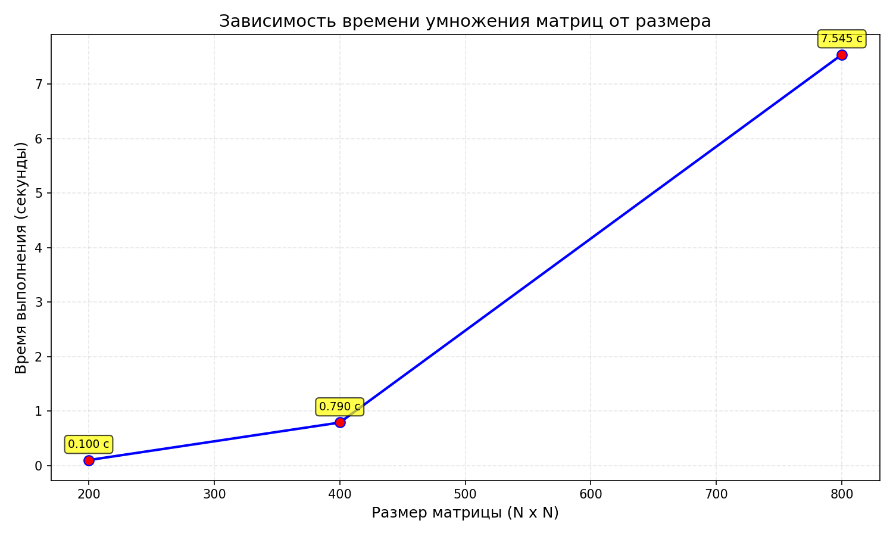
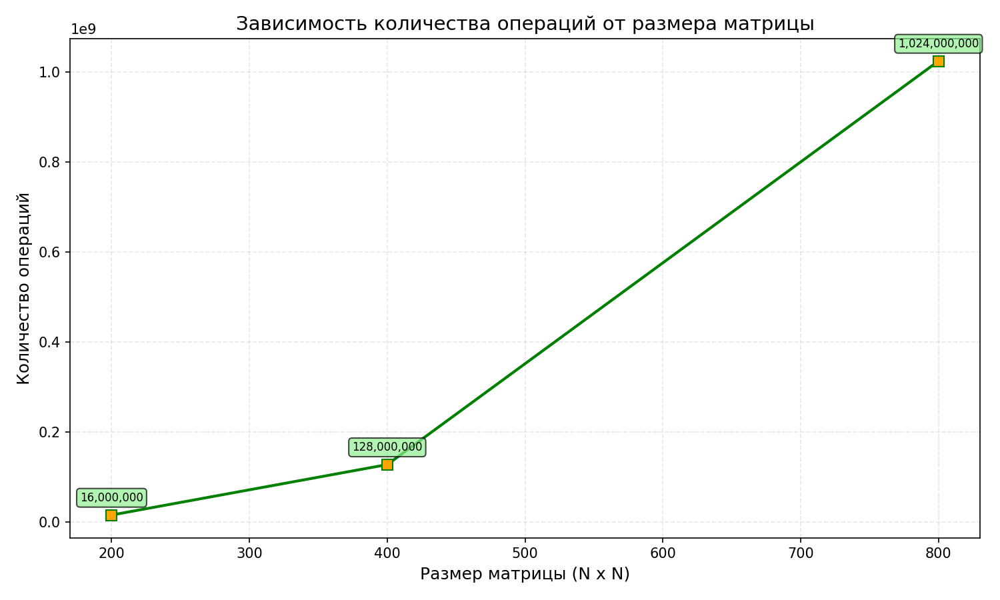

Лабораторная работа №1
Перемножение квадратных матриц
1. Задание
Написать программу на языке C/C++ для перемножения двух квадратных матриц.

Исходные данные: файлы, содержащие значения исходных матриц.

Выходные данные:

Файл со значениями результирующей матрицы

Время выполнения

Объем задачи

Обязательно: автоматизированная верификация результатов через NumPy/Python.

Таблица результатов
Размер	Элементов	Операций	Время (сек)
200×200	40 000	    16 000 000	    0.1004
400×400	160 000	    128 000 000	    0.7897
800×800	640 000	    1 024 000 000	7.5453
График времени выполнения

График количества операций

Верификация результатов

    ВЕРИФИКАЦИЯ РЕЗУЛЬТАТОВ 
Объем задачи: 200x200 (40000 элементов)
Размер 200x200:  ПРОЙДЕНА (макс. расхождение: 1.49e-03)
Объем задачи: 400x400 (160000 элементов)
Размер 400x400:  ПРОЙДЕНА (макс. расхождение: 2.34e-03)
Объем задачи: 800x800 (640000 элементов)
Размер 800x800:  ПРОЙДЕНА (макс. расхождение: 3.32e-03)
 ВСЕ ПРОВЕРКИ ПРОЙДЕНЫ УСПЕШНО!

Анализ результатов
Временная сложность
Переход	Рост размера	Рост времени	Теоретический (O(N³))
200→400	×2	            ×7.86	        ×8
400→800	×2	            ×9.55	        ×8
Вывод: Время растёт пропорционально N³, что соответствует теории.

Анализ операций
Количество операций умножения = N³. Для N=800:

800³ = 512 000 000 умножений

512 000 000 сложений = 1 024 000 000 операций

Производительность для N=800:

1.024 × 10⁹ операций / 7.545 сек ≈ 0.136 миллиарда операций с плавающей точкой в секунду

Выводы
Реализован алгоритм классического умножения квадратных матриц на C++.

Объем задачи:

200×200: 40 000 элементов, 16 млн операций

400×400: 160 000 элементов, 128 млн операций

800×800: 640 000 элементов, 1 024 млн операций

Время выполнения:

200×200: 0.1004 сек

400×400: 0.7897 сек

800×800: 7.5453 сек

Верификация через NumPy подтвердила корректность. Максимальное расхождение: 3.32×10⁻³, что в пределах погрешности.

Сложность O(N³) подтверждена экспериментально.